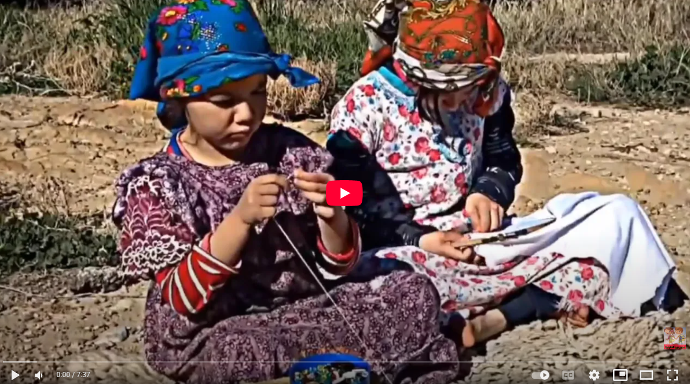

# Leveraging-AI-In-Education-Reference-
Copyright © 2025 Anes Abbas. All rights reserved.

## 1- Identify the Actors

* Teachers
* Management and admins
* Parents
* Kids **(Ideally indirectly)**

## 2- Identify The Priorities For Each Actor

* Teachers: Enhance planning & assessment, and support creativity
* Management/Admins: Improve efficiency, visibility, and communication
* Parents: Improve communication, and strengthen involvement
* Kids (Indirectly): Support learning, protect safety, and preserve play

## 3- Identify The Learning Domains for Kids

* Language & Early Literacy
* Numeracy & Logical Thinking
* Creative Expression
* Science & Discovery
* Physical & Motor Development
* Social & Emotional Skills
* Morality & Core Values

## 4- Setup a Framework: The FIG Education Model

* Facilitate access to the best quality resources. (Reading material, audiovisual material, equipment, facilities, etc.)
* Inspire students to see the beauty and utility in any given subject.
* Guide students towards independent exploration and support them on that journey.

Through this model one can *nurture* the two most important qualities of curiosity and capacity to self-learn.

**The key to genius**

> The spark to genius is passion. Passion leads to imagination,
imagination leads to creativity, and creativity leads to seeing or doing things in novel, unique, and exceptional ways.

## 5- Start Building

Brainsorm, Research, Score and build content.

But, wait, we still need a toolkit!!!

> **⚠ Caution:** Do not forget. AI is a double edged sword.

# The Toolkit

## Tools Selection Criteria

* Wide-range and fully rounded Toolkit 
* Easy for beginners to use
* Affordable with generous free-tier use quotas
* Powerful for the job

## The Tools

- Expert knowledge & Creative Writing: **[ChatGPT](https://chatgpt.com/)**
- Deep Grounded Research: **[Perplexity](https://www.perplexity.ai/?login-source=oneTapHome)**
- Knowledge Synthesis: **[NotebookLM](https://notebooklm.google.com/)**
- Multimedia Assets Generation (audio, video, images): **[Google AI studio](https://aistudio.google.com/prompts/new_chat)**
- 3D Assets Generation and Animation: **[Tripo](https://studio.tripo3d.ai/)**
- Multimedia Documents Generation: **[Canva Magic Suite](https://www.canva.com/ai)**
- App Developement and Vibe Coding: **[Google Build](https://aistudio.google.com/apps)**

## Prompting and Prompt Engineering

Prompt engineering is the process of crafting specific, effective instructions (prompts) to guide a generative AI model in producing desired outputs.

* Top and best
* Score and rank
* Compare across dimensions
* Breakdown assess 
* Assess content and creator

 

* Persona, task, context, and format
* Give References (sketch, image, etc.)
* Prompt generation

## Actors (Re-Visited)

Teachers, Management and admins, Parents, Kids **(Ideally indirectly)**

+ AI imagineers (Creative engineering)

Unlock more of the power of AI via the devlopement of advanced custom tool and content creation.

> "Imagineering is letting your imagination soar, and then engineering it down to earth," was a central slogan in a 1940s advertising campaign by the Aluminum Company of America (Alcoa).

## The AI Educator’s Commandments

- Thou shall avoid negative learning
- Thou shall avoid using AI just for hype
- Thou shall be mindful of others data privacy 
- Thou shall use AI to facilitate, inspire, and guide
- Thou shall not teach someone without sharing the commandments
- Thou shall re-visit these frequently 

## Let Kids Be Kids

Kids need to be free, and have a free space to:

* Explore
* Invent
* Query
* Socialize
* Fall
* Fail

**They need:** Guidance, support and wisdom.
**Not:** Over-protection, over-restriction, and micro-management.

[Play Video: Childhood Memories ](https://www.youtube.com/watch?v=Um7VPI-1oEI)

---

